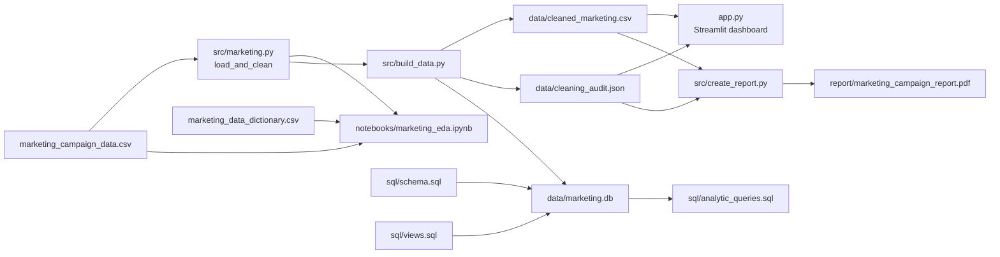

# Marketing campaign analytics: project workflow

This document explains how the supplied customer CSV becomes the notebook analysis, SQL database, dashboard, and business report. Run commands from the project root, where `app.py` and `requirements.txt` are located.

## 1. Data flow



The dashboard reads the cleaned CSV. If that file is absent, it runs `load_and_clean()` directly against the raw CSV. The notebook also calls the same cleaning function, so its feature rules match the dashboard and database.

## 2. Set up the environment

Use Python 3.10 or newer. On Windows PowerShell:

```powershell
python -m venv .venv
.\.venv\Scripts\Activate.ps1
python -m pip install -r requirements.txt
```

On macOS or Linux, activate with `source .venv/bin/activate`. The required libraries are listed in `requirements.txt`. If your IDE runs `app.py` as a normal Python script, use the Streamlit command in step 6 instead.

## 3. Inspect and clean the source

**Inputs:** `marketing_campaign_data.csv` and `marketing_data_dictionary.csv`.

`src/marketing.py` checks required columns, removes duplicate IDs, parses `Dt_Customer`, validates numeric and binary fields, and checks ages. Rows with unknown spend, purchase, or campaign values are excluded because an unknown value should not be counted as zero. Missing income, if a future file contains it, is imputed with a country median and then the overall median; an `Income_Imputed` flag records this. Unusually high income is retained with an `Income_Outlier` flag.

The age and customer tenure reference date is the **latest enrollment date in the file (2014-06-29)**. This keeps results stable when the project is rerun in a later year. The source dictionary does not identify a currency, so all monetary results use **source units**.

The pipeline then calculates:

| Feature | Rule |
|---|---|
| `Age` | Reference year minus `Year_Birth` |
| `Customer_Tenure_Days` | Reference date minus `Dt_Customer` |
| `Children` | `Kidhome + Teenhome` |
| `Total_Spend` | Sum of the six product spending columns |
| `Total_Purchases` | Web + catalog + store purchases |
| `Campaign_Acceptances` | Sum of Campaigns 1–5 and latest `Response` |
| `Any_Campaign_Response` | 1 if at least one campaign was accepted |
| `Age_Band`, `Income_Band` | Fixed bands for dashboard and SQL comparisons |

`NumDealsPurchases` is a count of discounted purchases, not a separate purchase channel; it is not added to `Total_Purchases`.

## 4. Apply business segments

The same cleaned table contains the six segments requested by the assignment:

| Segment flag | Membership rule |
|---|---|
| `High_Income` | `Income > 75000` |
| `Young_Customer` | `Age < 30` |
| `Campaign_Responder` | Latest `Response = 1` |
| `High_Web_Engagement` | `NumWebVisitsMonth > 5` |
| `Family_Customer` | `Children > 0` |
| `High_Spender` | `Total_Spend` above the full cleaned data's 90th percentile |

Customers may belong to several segments. `Under_Served` is a separate diagnostic flag: below-median spend, more than five monthly web visits, and no latest-campaign response. `Campaign_Responder` and `Under_Served` both use `Response` in their definitions, so their response rates must not be interpreted as independent evidence of campaign effectiveness.

## 5. Build the analysis data and SQL layer

```powershell
python -m src.build_data
```

This command writes `data/cleaned_marketing.csv` and `data/cleaning_audit.json`, creates the `customers` table and indexes from `sql/schema.sql`, loads the clean rows into `data/marketing.db`, and recreates the views in `sql/views.sql`. It is safe to rerun: the customer table is refreshed from the CSV rather than appended with duplicate records.

The SQL views provide one row per customer per campaign (`campaign_responses`), rule-based customer memberships (`customer_segments`), and segment KPIs (`segment_kpis`). `sql/analytic_queries.sql` contains overall KPIs, campaign rates, demographic profiles, product mix, channel behavior, underserved groups, and ranked prospective target cohorts. Execute these statements in any SQLite client connected to `data/marketing.db`.

**Expected audit for the supplied CSV:** 56,000 source and retained rows, zero duplicate IDs, zero incomplete/invalid rows, zero implausible ages, zero income imputations, and 14 flagged high incomes. The high-spender cutoff is 1,564 source units.

## 6. Explore the notebook and dashboard

Open `notebooks/marketing_eda.ipynb` in VS Code or Jupyter and run all cells. Its sections cover source profiling, cleaning, univariate distributions, campaign response by customer profile, product/channel comparisons, rule-based segments, target hypotheses, and an income-outlier sensitivity check. `notebooks/build_notebook.py` regenerates the notebook file; run it only when you intend to replace edits made inside the notebook.

Start the interactive dashboard:

```powershell
python -m streamlit run app.py
```

Open the **Local URL** printed in the terminal, normally [http://localhost:8501](http://localhost:8501). Keep the terminal running while using the dashboard. If port 8501 is already in use, Streamlit may print a different port; use the URL it shows.

The sidebar filters all five tabs by country, education, marital status, age band, and income band. The tabs cover overview KPIs, campaigns and segments, product/channel behavior, opportunities, and data quality. The Data quality tab can download the filtered clean rows.

## 7. Create the business report

```powershell
python -m src.create_report
```

This rebuilds `report/marketing_campaign_report.pdf` from the clean CSV and audit. The report presents the problem, data handling, major patterns, a campaign chart, six testable recommendations, and limits of the evidence.

## 8. Verify a complete run

| Check | Expected result with the supplied data |
|---|---|
| Cleaning audit | 56,000 retained customers; 14 income outliers flagged |
| SQL `customers` table | 56,000 rows |
| SQL `campaign_responses` view | 336,000 rows (56,000 customers × 6 campaigns) |
| Dashboard overall KPIs | 56,000 customers; 14.8% latest response; 36.4% any-campaign response |
| Dashboard Country = India | 4,814 customers; 18.8% latest response |
| Report output | `report/marketing_campaign_report.pdf` opens as a three-page PDF |

For a quick SQL row check:

```powershell
python -c "import sqlite3; c=sqlite3.connect('data/marketing.db'); print(c.execute('SELECT COUNT(*) FROM customers').fetchone()[0])"
```

## 9. Refresh with updated data

1. Replace `marketing_campaign_data.csv` with a file using the same field names and meanings.
2. Run `python -m src.build_data` to regenerate the clean CSV, audit, and database.
3. Run the notebook and inspect its charts and audit; investigate new exclusions or outlier spikes.
4. Run `python -m src.create_report` so the PDF reflects the refreshed data.
5. Restart or rerun Streamlit to clear its cached data and review dashboard filters and KPIs.

The analysis describes associations in historical customer records. Campaign exposure, offer details, campaign costs, and assignment rules are unavailable, so the output cannot establish causal lift or return on investment. Test promising target groups with a controlled campaign before rollout.
